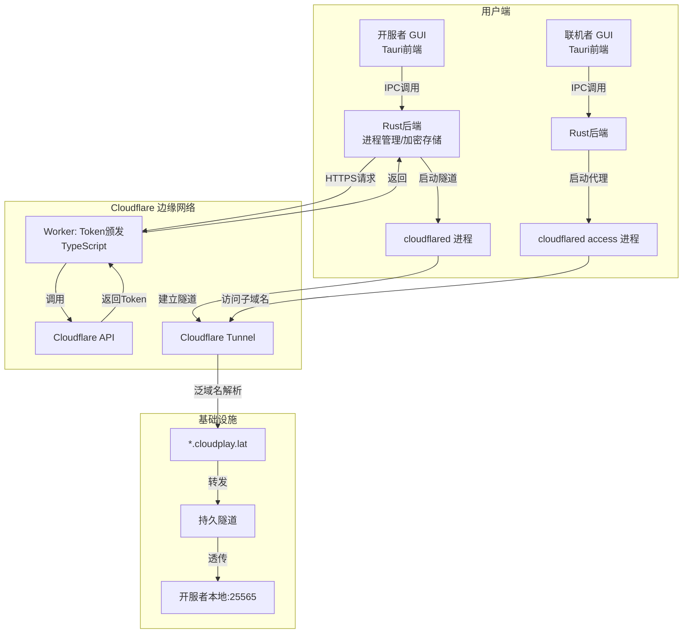

# CloudPlay 技术设计文档

**项目名称**：CloudPlay
**文档版本**：v3.1
**更新日期**：2026-07-13
**技术栈**：Tauri (Rust) + Cloudflare Workers (TypeScript)
**目标**：构建一个高性能、安全、跨平台的图形化局域网游戏远程联机服务平台。

---

## 1. 项目概述

### 1.1 背景与痛点

局域网游戏Java版原生支持局域网联机，但异地好友无法直接连接。传统方案（端口映射、VPN）对普通玩家技术门槛高，而现有免费穿透服务在国内已被污染或延迟过高。

### 1.2 解决方案

开发一款基于 **Tauri (Rust)** 的图形化桌面应用，封装 `cloudflared` 二进制文件。服务提供方持有自有域名 `cloudplay.lat`，通过泛域名解析和 Cloudflare Tunnel，为每位用户分配唯一的子域名（如 `player123.cloudplay.lat`），实现"开服者一键启动，联机者一键连接"的便捷体验。

### 1.3 核心设计原则

1. **免费优先**：充分利用 Cloudflare 免费套餐，降低用户使用成本。
2. **开箱即用**：图形化封装，用户无需接触命令行。
3. **极致性能**：基于 Rust 的原生客户端，内存占用低、启动速度快。
4. **安全加固**：核心逻辑编译至二进制，Token 存储于操作系统级安全区域。

---

## 2. 系统架构

### 2.1 整体架构图



### 2.2 核心组件清单

| 组件 | 技术选型 | 部署位置 | 职责 |
| :--- | :--- | :--- | :--- |
| **GUI 前端** | React + TypeScript + TailwindCSS | 用户本地 | 渲染界面，响应用户交互，通过 IPC 调用 Rust 后端 |
| **Rust 后端** | Tauri + Tokio + Serde | 用户本地 | 管理 `cloudflared` 进程，Token 安全存储，端口检测，日志处理 |
| **Token 颁发服务** | Cloudflare Workers + TypeScript + Hono | Cloudflare 边缘节点 | 接收房间 ID 请求，调用 Cloudflare API 生成临时隧道令牌 |
| **数据存储** | Cloudflare KV | Cloudflare 边缘节点 | 存储速率限制计数、黑名单等临时数据 |
| **持久隧道** | Cloudflare Tunnel (免费) | Cloudflare 边缘节点 | 接收泛域名流量，透传至开服者本地端口 |
| **官网与下载页** | Cloudflare Pages | Cloudflare 边缘节点 | 展示产品信息，分发各平台安装包 |

---

## 3. 网络路由与域名设计

### 3.1 DNS 解析方案

采用 **泛域名解析（Wildcard DNS）** 架构，在 Cloudflare DNS 面板添加一条 CNAME 记录：

| 记录类型 | 名称 | 目标地址 | 代理状态 |
| :--- | :--- | :--- | :--- |
| CNAME | `*` | `<隧道UUID>.cfargotunnel.com` | 已代理（橙色云朵） |

此配置确保所有子域名（`*.cloudplay.lat`）的请求均被转发至同一持久隧道，无需为每位用户手动配置 DNS 记录。

### 3.2 子域名分配逻辑

- **格式**：`{用户自定义ID}.cloudplay.lat`
- **层级说明**：虽然这是三级域名，但 Cloudflare 免费套餐的通配符证书（`*.cloudplay.lat`）完全覆盖，SSL 握手正常。
- **分配方式**：用户在 GUI 输入房间名/ID，Rust 后端自动拼接完整地址，向 Worker 请求对应的隧道令牌。

### 3.3 域名层级设计

| 子域名 | 用途 | 托管于 |
| :--- | :--- | :--- |
| `*.cloudplay.lat` | 游戏隧道泛解析 | Cloudflare Tunnel |
| `cloudplay.lat` / `www.cloudplay.lat` | 官网及下载页 | Cloudflare Pages |
| `api.cloudplay.lat` | Token 颁发 API | Cloudflare Workers |
| `cdn.cloudplay.lat` | 安装包等静态资源（可选） | Cloudflare R2 |

---

## 4. 核心模块详细设计

### 4.1 后端服务：Token 颁发 Worker (TypeScript)

这是整个平台的安全核心，负责动态生成短时效的隧道令牌。

#### 4.1.1 技术栈

| 依赖 | 用途 |
| :--- | :--- |
| `hono` | 轻量级 Web 框架，专为 Cloudflare Workers 优化 |
| `@cloudflare/workers-types` | TypeScript 类型支持 |
| `wrangler` | 部署与配置管理工具 |

#### 4.1.2 API 接口设计

**端点**：`POST https://api.cloudplay.lat/api/token`

**请求体**：
```json
{
  "roomId": "john123"
}
```

**响应（成功）**：
```json
{
  "success": true,
  "data": {
    "hostname": "john123.cloudplay.lat",
    "token": "eyJhbGciOiJIUzI1NiIs...",
    "expiresIn": 3600
  }
}
```

**响应（失败）**：
```json
{
  "success": false,
  "error": "Invalid room ID format"
}
```

#### 4.1.3 核心代码实现

```typescript
// src/index.ts
import { Hono } from 'hono';
import { cors } from 'hono/cors';
import { rateLimiter } from './middleware/rate-limiter';

type Bindings = {
  KV_STORE: KVNamespace;
  ACCOUNT_ID: string;
  TUNNEL_ID: string;
  CLOUDFLARE_API_TOKEN: string;
};

const app = new Hono<{ Bindings: Bindings }>();

app.use('*', cors({
  origin: ['https://cloudplay.lat', 'https://www.cloudplay.lat'],
  allowMethods: ['POST', 'GET', 'OPTIONS']
}));

app.post('/api/token', rateLimiter, async (c) => {
  const { roomId } = await c.req.json();

  // 1. 格式校验：仅允许字母、数字、下划线、连字符，长度 3-20
  if (!roomId || !/^[a-zA-Z0-9_-]{3,20}$/.test(roomId)) {
    return c.json({ success: false, error: 'Invalid room ID' }, 400);
  }

  const hostname = `${roomId}.cloudplay.lat`;
  const { ACCOUNT_ID, TUNNEL_ID, CLOUDFLARE_API_TOKEN } = c.env;

  // 2. 调用 Cloudflare API 生成令牌
  const resp = await fetch(
    `https://api.cloudflare.com/client/v4/accounts/${ACCOUNT_ID}/cfd_tunnel/${TUNNEL_ID}/tokens`,
    {
      method: 'POST',
      headers: {
        'Authorization': `Bearer ${CLOUDFLARE_API_TOKEN}`,
        'Content-Type': 'application/json',
      },
      body: JSON.stringify({
        hostname: hostname,
        ttl: 3600, // 1 小时有效期
      })
    }
  );

  const data = await resp.json();
  if (!data.success) {
    console.error('Cloudflare API error:', data.errors);
    return c.json({ success: false, error: 'Failed to create tunnel token' }, 500);
  }

  // 3. 返回令牌
  return c.json({
    success: true,
    data: {
      hostname: hostname,
      token: data.result.token,
      expiresIn: data.result.expires_at || 3600,
    }
  });
});

// 健康检查
app.get('/api/health', (c) => c.json({ status: 'ok' }));

export default app;
```

#### 4.1.4 速率限制中间件 (KV 实现)

```typescript
// src/middleware/rate-limiter.ts
import { MiddlewareHandler } from 'hono';

export const rateLimiter: MiddlewareHandler = async (c, next) => {
  const ip = c.req.header('CF-Connecting-IP') || 'unknown';
  const key = `ratelimit:${ip}`;
  const kv = c.env.KV_STORE;

  // 获取当前计数和时间戳
  const record = await kv.get<{ count: number; timestamp: number }>(key, 'json');
  const now = Date.now();
  const windowMs = 60 * 1000; // 1 分钟窗口

  // 如果记录不存在或已过期，重置计数
  if (!record || (now - record.timestamp) > windowMs) {
    await kv.put(key, JSON.stringify({ count: 1, timestamp: now }), { expirationTtl: 120 });
    await next();
    return;
  }

  // 检查是否超过限制（每分钟 10 次）
  if (record.count >= 10) {
    return c.json({ success: false, error: 'Rate limit exceeded. Try again later.' }, 429);
  }

  // 递增计数
  await kv.put(key, JSON.stringify({ count: record.count + 1, timestamp: record.timestamp }), { expirationTtl: 120 });
  await next();
};
```

#### 4.1.5 配置文件 (wrangler.toml)

```toml
name = "cloudplay-backend"
main = "src/index.ts"
compatibility_date = "2024-12-18"

[[kv_namespaces]]
binding = "KV_STORE"
id = "你的KV命名空间ID"

[vars]
ACCOUNT_ID = "你的Cloudflare账户ID"
TUNNEL_ID = "你的持久隧道ID"

# 敏感变量通过 wrangler secret put 注入：
# CLOUDFLARE_API_TOKEN = "Bearer xxx"
```

---

### 4.2 客户端：Tauri (Rust + React)

#### 4.2.1 技术栈详解

| 层级 | 技术 | 用途 |
| :--- | :--- | :--- |
| **GUI 框架** | Tauri v2 | 跨平台桌面应用框架，后端 Rust + 前端 WebView |
| **Rust 后端** | Tokio (异步运行时), Serde (序列化), anyhow (错误处理) | 进程管理、HTTP 请求、加密存储、端口检测 |
| **前端框架** | React 18 + TypeScript | UI 渲染、状态管理 |
| **UI 组件** | shadcn/ui + TailwindCSS | 现代化界面设计 |
| **状态管理** | Zustand | 前端状态管理（隧道状态、配置等） |
| **HTTP 客户端** | `reqwest` (Rust) / `fetch` (前端) | 调用 Worker API |
| **安全存储** | `keyring` crate | 操作系统级凭证存储（Windows Credential Manager / macOS Keychain） |
| **进程管理** | `std::process` + `tokio::process` | `cloudflared` 子进程生命周期管理 |
| **自动更新** | `tauri-plugin-updater` | 增量更新，配合 GitHub Releases |

#### 4.2.2 Rust 后端核心模块设计

```text
src-tauri/
├── src/
│   ├── main.rs                 # Tauri 应用入口
│   ├── commands/
│   │   ├── mod.rs              # Tauri 命令注册
│   │   ├── tunnel.rs           # 隧道启动/停止命令
│   │   ├── token.rs            # Token 请求与存储命令
│   │   ├── port.rs             # 端口检测命令
│   │   └── logs.rs             # 日志流订阅命令
│   ├── services/
│   │   ├── mod.rs
│   │   ├── cloudflared.rs      # cloudflared 进程管理核心
│   │   ├── api_client.rs       # Worker API 调用
│   │   ├── credential.rs       # 操作系统级安全存储
│   │   └── port_scanner.rs     # 端口占用检测
│   ├── models/
│   │   └── mod.rs              # 数据结构定义
│   └── utils/
│       └── logger.rs           # 日志格式化与输出
├── Cargo.toml
├── tauri.conf.json             # Tauri 配置
└── capabilities/               # 权限声明
```

#### 4.2.3 核心 Rust 代码实现

**0. 应用状态 (`models/mod.rs`)**

```rust
use serde::{Deserialize, Serialize};
use std::sync::Arc;
use tokio::sync::Mutex;
use crate::services::cloudflared::TunnelManager;
use crate::services::api_client::ApiClient;

/// 应用全局状态
pub struct AppState {
    pub tunnel_manager: TunnelManager,
    pub api_client: ApiClient,
    pub current_hostname: Arc<Mutex<Option<String>>>,
}

/// Token API 响应
#[derive(Debug, Deserialize)]
pub struct TokenResponse {
    pub success: bool,
    pub data: Option<TokenData>,
    pub error: Option<String>,
}

#[derive(Debug, Deserialize)]
pub struct TokenData {
    pub hostname: String,
    pub token: String,
    pub expires_in: u64,
}
```

**1. cloudflared 进程管理 (`services/cloudflared.rs`)**

```rust
use tokio::process::Child as TokioChild;
use tokio::io::{BufReader, AsyncBufReadExt};
use std::sync::Arc;
use tokio::sync::Mutex;

pub struct TunnelManager {
    process: Arc<Mutex<Option<TokioChild>>>,
}

impl TunnelManager {
    pub fn new() -> Self {
        Self {
            process: Arc::new(Mutex::new(None)),
        }
    }

    /// 使用 Token 启动隧道
    pub async fn start_with_token(&self, token: &str) -> Result<(), String> {
        let mut child = tokio::process::Command::new("cloudflared")
            .arg("tunnel")
            .arg("run")
            .arg("--token")
            .arg(token)
            .stdout(std::process::Stdio::piped())
            .stderr(std::process::Stdio::piped())
            .spawn()
            .map_err(|e| format!("Failed to spawn cloudflared: {}", e))?;

        let stdout = child.stdout.take().expect("Failed to capture stdout");
        let mut reader = BufReader::new(stdout).lines();

        // 在独立任务中读取日志并转发到前端
        tokio::spawn(async move {
            while let Ok(Some(line)) = reader.next_line().await {
                // 通过 Tauri 事件系统发送日志到前端
                if line.contains("INF") && line.contains("connection established") {
                    // 解析成功状态，触发前端 UI 更新
                }
                println!("[cloudflared] {}", line);
            }
        });

        // 保存进程句柄
        let mut guard = self.process.lock().await;
        *guard = Some(child);
        Ok(())
    }

    /// 停止隧道
    pub async fn stop(&self) -> Result<(), String> {
        let mut guard = self.process.lock().await;
        if let Some(mut child) = guard.take() {
            child.kill().await.map_err(|e| format!("Failed to kill process: {}", e))?;
            child.wait().await.map_err(|e| format!("Failed to wait for process: {}", e))?;
        }
        Ok(())
    }

    /// 检查隧道是否正在运行
    pub async fn is_running(&self) -> bool {
        let guard = self.process.lock().await;
        guard.is_some()
    }
}
```

**2. Token 安全存储 (`services/credential.rs`)**

```rust
use keyring::Entry;

const SERVICE_NAME: &str = "cloudplay";

/// 将 Token 存储到操作系统安全区域
pub fn store_token(hostname: &str, token: &str) -> Result<(), String> {
    let entry = Entry::new(SERVICE_NAME, &format!("token_{}", hostname))
        .map_err(|e| format!("Failed to create keyring entry: {}", e))?;
    entry.set_password(token)
        .map_err(|e| format!("Failed to store token: {}", e))?;
    Ok(())
}

/// 从安全区域读取 Token
pub fn get_token(hostname: &str) -> Result<String, String> {
    let entry = Entry::new(SERVICE_NAME, &format!("token_{}", hostname))
        .map_err(|e| format!("Failed to open keyring entry: {}", e))?;
    entry.get_password()
        .map_err(|e| format!("Failed to retrieve token: {}", e))
}

/// 删除 Token
pub fn delete_token(hostname: &str) -> Result<(), String> {
    let entry = Entry::new(SERVICE_NAME, &format!("token_{}", hostname))
        .map_err(|e| format!("Failed to open keyring entry: {}", e))?;
    entry.delete_credential()
        .map_err(|e| format!("Failed to delete token: {}", e))?;
    Ok(())
}
```

**3. 端口检测 (`services/port_scanner.rs`)**

```rust
use std::net::TcpListener;

/// 检测端口是否被占用
pub fn is_port_available(port: u16) -> bool {
    TcpListener::bind(("127.0.0.1", port)).is_ok()
}

/// 查找可用端口（从指定端口开始向上扫描）
pub fn find_available_port(start: u16, max_attempts: u16) -> Option<u16> {
    for port in start..=start.saturating_add(max_attempts) {
        if is_port_available(port) {
            return Some(port);
        }
    }
    None
}
```

**4. Tauri 命令注册 (`commands/tunnel.rs`)**

```rust
use tauri::State;
use serde::{Deserialize, Serialize};
use crate::models::AppState;
use crate::services::port_scanner::is_port_available;

#[derive(Deserialize)]
pub struct StartTunnelRequest {
    pub room_id: String,
    pub local_port: u16,
}

#[derive(Serialize)]
pub struct StartTunnelResponse {
    pub success: bool,
    pub hostname: Option<String>,
    pub error: Option<String>,
}

#[tauri::command]
pub async fn start_tunnel(
    state: State<'_, AppState>,
    request: StartTunnelRequest,
) -> Result<StartTunnelResponse, String> {
    // 1. 检测端口是否可用
    if !is_port_available(request.local_port) {
        return Ok(StartTunnelResponse {
            success: false,
            hostname: None,
            error: Some(format!("Port {} is already in use", request.local_port)),
        });
    }

    // 2. 调用 Worker API 获取 Token
    let api_client = &state.api_client;
    let token_response = api_client.request_token(&request.room_id).await?;

    if !token_response.success {
        return Ok(StartTunnelResponse {
            success: false,
            hostname: None,
            error: token_response.error,
        });
    }

    let token_data = token_response.data.ok_or("Missing token data")?;
    let hostname = token_data.hostname.clone();

    // 3. 安全存储 Token（仅内存中，不落盘）
    *state.current_hostname.lock().await = Some(hostname.clone());

    // 4. 启动 cloudflared 隧道
    let tunnel_manager = &state.tunnel_manager;
    tunnel_manager.start_with_token(&token_data.token).await?;

    Ok(StartTunnelResponse {
        success: true,
        hostname: Some(hostname),
        error: None,
    })
}

#[tauri::command]
pub async fn stop_tunnel(state: State<'_, AppState>) -> Result<(), String> {
    let tunnel_manager = &state.tunnel_manager;
    tunnel_manager.stop().await?;
    *state.current_hostname.lock().await = None;
    Ok(())
}
```

#### 4.2.4 前端核心交互流程 (React)

```tsx
// services/api.ts
import { invoke } from '@tauri-apps/api/core';

export interface TokenResponse {
  success: boolean;
  data?: {
    hostname: string;
    token: string;
    expiresIn: number;
  };
  error?: string;
}

export interface StartTunnelResponse {
  success: boolean;
  hostname?: string;
  error?: string;
}

export async function requestToken(roomId: string): Promise<TokenResponse> {
  const response = await fetch('https://api.cloudplay.lat/api/token', {
    method: 'POST',
    headers: { 'Content-Type': 'application/json' },
    body: JSON.stringify({ roomId }),
  });
  return response.json();
}

// pages/Host.tsx
import { useState, useCallback } from 'react';
import { invoke } from '@tauri-apps/api/core';

export function HostPage() {
  const [roomId, setRoomId] = useState('');
  const [localPort, setLocalPort] = useState('25565');
  const [status, setStatus] = useState<'idle' | 'connecting' | 'running' | 'error'>('idle');
  const [hostname, setHostname] = useState('');
  const [errorMessage, setErrorMessage] = useState('');

  const handleStart = useCallback(async () => {
    setStatus('connecting');
    setErrorMessage('');
    try {
      // 调用 Tauri Rust 后端命令
      const response = await invoke<StartTunnelResponse>('start_tunnel', {
        request: {
          room_id: roomId,
          local_port: parseInt(localPort),
        },
      });
      if (response.success) {
        setHostname(response.hostname!);
        setStatus('running');
      } else {
        setStatus('error');
        setErrorMessage(response.error || 'Failed to start tunnel');
      }
    } catch (error) {
      setStatus('error');
      setErrorMessage(error instanceof Error ? error.message : 'Unknown error');
    }
  }, [roomId, localPort]);

  const handleStop = useCallback(async () => {
    try {
      await invoke('stop_tunnel');
      setStatus('idle');
      setHostname('');
    } catch (error) {
      console.error('Failed to stop tunnel:', error);
    }
  }, []);

  return (
    <div className="container mx-auto p-6">
      <h1 className="text-2xl font-bold mb-6">开服者模式</h1>

      <div className="space-y-4">
        <div>
          <label className="block text-sm font-medium mb-1">房间 ID</label>
          <input
            type="text"
            value={roomId}
            onChange={(e) => setRoomId(e.target.value)}
            placeholder="输入房间名称（3-20 位字母数字）"
            className="w-full p-2 border rounded"
            disabled={status === 'running'}
          />
        </div>

        <div>
          <label className="block text-sm font-medium mb-1">本地端口</label>
          <input
            type="number"
            value={localPort}
            onChange={(e) => setLocalPort(e.target.value)}
            placeholder="25565"
            className="w-full p-2 border rounded"
            disabled={status === 'running'}
          />
        </div>

        {status === 'idle' || status === 'error' ? (
          <button onClick={handleStart} className="btn-primary">
            启动隧道
          </button>
        ) : status === 'running' ? (
          <button onClick={handleStop} className="btn-danger">
            停止隧道
          </button>
        ) : (
          <button disabled className="btn-disabled">
            连接中...
          </button>
        )}

        {hostname && (
          <div className="p-4 bg-green-50 border border-green-200 rounded">
            <p className="font-medium">隧道已启动！</p>
            <p className="text-sm text-gray-600">
              分享此地址给好友：<code className="bg-gray-100 px-2 py-1 rounded">{hostname}</code>
            </p>
          </div>
        )}

        {errorMessage && (
          <div className="p-4 bg-red-50 border border-red-200 rounded">
            <p className="text-red-600">{errorMessage}</p>
          </div>
        )}
      </div>
    </div>
  );
}
```

---

### 4.3 联机者 GUI 模块（玩家端）

联机者界面同样基于 Tauri + Rust，操作更为精简。

#### 4.3.1 主要交互流程

1. 玩家输入开服者提供的地址（如 `john123.cloudplay.lat`）。
2. 点击"连接游戏"。
3. Rust 后端执行命令：
    ```bash
    cloudflared access tcp --hostname john123.cloudplay.lat --url localhost:25566
    ```
4. 后端启动成功后，前端提示玩家在 游戏中连接 `localhost:25566`（端口可自定义）。

#### 4.3.2 端口冲突处理

联机者端默认使用 `25566` 端口（避免与开服者默认端口 `25565` 冲突）。如果该端口被占用：

1. 自动扫描下一个可用端口（25567, 25568, ...）。
2. 在 UI 上显示实际使用的端口号。
3. 允许用户手动指定端口。

#### 4.3.3 与开服者界面的代码复用

Tauri 项目可共享 Rust 后端代码（如 `cloudflared` 进程管理），前端通过路由切换两种模式，最大化复用率。

---

## 5. 应用分发方案

### 5.1 分发渠道策略

| 渠道 | 用途 | 优势 |
| :--- | :--- | :--- |
| **Cloudflare Pages 官网** | 主下载入口 | 全球 CDN 加速，域名权威 |
| **GitHub Releases** | 备用下载 + 自动更新源 | 版本管理清晰，支持 Release Notes |
| **Tauri 内置更新器** | 增量更新 | 仅下载变更部分，用户体验最佳 |

### 5.2 安装包构建与签名

| 平台 | Tauri 构建目标 | 签名要求 |
| :--- | :--- | :--- |
| **Windows** | `tauri build --target windows` | 使用 DigiCert 代码签名证书，避免 SmartScreen 拦截 |
| **macOS** | `tauri build --target universal-apple-darwin` | 必须使用 Apple Developer ID 签名并公证 |
| **Linux (deb)** | `tauri build --target deb` | 无需签名，提供 `.deb` 和 `.AppImage` |

### 5.3 Tauri 打包配置 (`tauri.conf.json`)

```json
{
  "build": {
    "beforeDevCommand": "npm run dev",
    "beforeBuildCommand": "npm run build",
    "devUrl": "http://localhost:1420"
  },
  "bundle": {
    "active": true,
    "identifier": "app.cloudplay.lat",
    "icon": ["icons/32x32.png", "icons/128x128.png", "icons/256x256.png"],
    "windows": {
      "certificateThumbprint": "你的证书指纹",
      "digestAlgorithm": "sha256",
      "timestampUrl": "http://timestamp.digicert.com"
    },
    "macOS": {
      "entitlements": "entitlements.plist",
      "signingIdentity": "Developer ID Application: Your Name (TEAM_ID)"
    }
  },
  "plugins": {
    "updater": {
      "pubkey": "你的公钥",
      "endpoints": ["https://github.com/your-repo/releases/download/updates.json"]
    }
  }
}
```

### 5.4 嵌入式 `cloudflared` 管理

- **打包策略**：将 `cloudflared` 二进制文件嵌入 Tauri 应用的 `resources` 目录，首次启动时释放到用户数据目录（如 `~/.cloudplay/bin/`）。
- **Rust 实现**：使用 `std::env::current_exe()` 获取应用路径，拼接资源目录路径，确保跨平台兼容。

---

## 6. 部署与运维

### 6.1 后端 Worker 部署

```bash
npm install
npx wrangler login
npx wrangler secret put CLOUDFLARE_API_TOKEN
npx wrangler deploy
```

### 6.2 官网（Pages）部署

- 官网静态文件托管在 Cloudflare Pages，连接 GitHub 仓库后自动构建部署。
- 域名绑定：`cloudplay.lat` 指向 Pages 项目。

### 6.3 监控与可观测性

| 需求 | 方案 |
| :--- | :--- |
| **API 调用日志** | `wrangler tail` 实时查看 |
| **异常告警** | Cloudflare 告警策略（HTTP 5xx 阈值） |
| **客户端崩溃上报** | Tauri 集成 Sentry 或自定义上报 |

---

## 7. 安全设计

### 7.1 凭证安全

| 风险 | 缓解措施 |
| :--- | :--- |
| **主账号 Token 泄露** | Worker 中仅存储最小权限 API Token，通过 `wrangler secret` 注入 |
| **用户 Token 被盗用** | Token 有效期 1 小时，绑定特定子域名 |
| **Token 本地存储** | 使用操作系统级安全存储（Keychain），不落盘 |
| **暴力枚举房间 ID** | 速率限制 + 黑名单（KV） |

### 7.2 应用安全

| 层面 | 措施 |
| :--- | :--- |
| **源码保护** | Rust 编译为二进制，核心逻辑难以逆向 |
| **通信安全** | 全部 HTTPS（Worker 默认支持） |
| **安装包完整性** | macOS 公证 + Windows 签名 + SHA256 校验 |
| **用户输入** | 房间 ID 正则过滤 `[a-zA-Z0-9_-]` |

---

## 8. 流量与成本预估

### 8.1 Cloudflare 免费额度

| 服务 | 免费额度 | 本项目使用情况 |
| :--- | :--- | :--- |
| **Workers** | 每日 10 万次请求 | Token 颁发请求，初期远低于此 |
| **KV** | 每日 1 千次读/写 | 速率限制计数，极轻量 |
| **Tunnel** | 无限流量（ToS） | 游戏流量穿透 |
| **Pages** | 无限流量 | 官网下载页 |

### 8.2 成本控制措施

- **安装包分发**：大文件使用 GitHub Releases。
- **Token 有效期**：1 小时，避免长时间占用。
- **用户引导**：用完即关，减少空转。

---

## 9. 里程碑与待办事项

| 阶段 | 任务 | 优先级 | 状态 |
| :--- | :--- | :--- | :--- |
| **阶段一：基础设施** | 注册 `cloudplay.lat`，接入 Cloudflare | P0 | 待办 |
| | 配置泛域名解析 `*.cloudplay.lat` | P0 | 待办 |
| | 创建持久隧道，获取 Tunnel UUID | P0 | 待办 |
| | 创建 Cloudflare KV 命名空间 | P0 | 待办 |
| **阶段二：后端开发** | 搭建 Worker 项目脚手架 (TS + Hono) | P0 | 待办 |
| | 实现 Token 颁发 API | P0 | 待办 |
| | 实现速率限制中间件 | P0 | 待办 |
| | 部署 Worker 到边缘节点 | P0 | 待办 |
| **阶段三：Tauri 客户端** | 搭建 Tauri + React + TS 项目 | P0 | 待办 |
| | 实现 Rust 进程管理模块 (`cloudflared`) | P0 | 待办 |
| | 实现 Token 安全存储 (Keychain) | P0 | 待办 |
| | 实现端口检测命令 | P0 | 待办 |
| | 实现开服者界面（Host） | P0 | 待办 |
| | 实现联机者界面（Client） | P1 | 待办 |
| | 对接后端 Token API | P0 | 待办 |
| | 日志流实时推送至前端 | P1 | 待办 |
| **阶段四：分发与发布** | 搭建 Pages 官网下载页 | P0 | 待办 |
| | 配置 GitHub Releases 自动构建 | P1 | 待办 |
| | 代码签名与公证（Windows + macOS） | P0 | 待办 |
| | 集成 Tauri 自动更新 | P1 | 待办 |
| | 发布 Beta 版本，内部测试 | P0 | 待办 |
| | 正式发布 v1.0 | P0 | 待办 |

---

## 10. 技术亮点与未来展望

### 10.1 技术亮点总结

| 特性 | 技术实现 | 用户价值 |
| :--- | :--- | :--- |
| **极致轻量** | Tauri (Rust) 替代 Electron | 安装包 < 20MB，内存占用低 |
| **源码保护** | Rust 核心逻辑编译至二进制 | 商业逻辑难以被逆向或篡改 |
| **安全存储** | 操作系统 Keychain | Token 不落盘，防止泄露 |
| **快速启动** | Rust 异步运行时 (Tokio) | 隧道启动响应迅速 |
| **全球低延迟** | Cloudflare Workers 边缘计算 | API 请求就近处理 |
| **零配置穿透** | 泛域名 + 动态 Token | 用户无需路由器设置 |

### 10.2 未来扩展方向

1. **多游戏支持**：增加对《泰拉瑞亚》《异星工厂》等其他局域网联机游戏的支持。
2. **用户系统**：接入 Cloudflare D1 数据库，实现用户注册/登录，房间持久化。
3. **流量统计**：记录每个隧道的数据传输量，提供使用仪表盘。

---

## 11. 总结

本方案通过 **Tauri (Rust) + Cloudflare Workers (TypeScript) + 泛域名解析**，构建了一个高性能、安全、易用的 局域网游戏远程联机服务平台。

**核心优势**：

- **极致性能**：Rust 原生客户端，包体小、启动快、内存省。
- **安全加固**：核心逻辑编译至二进制，Token 存储于操作系统安全区域。
- **零配置穿透**：用户无需路由器设置，无需公网 IP。
- **全栈 Cloudflare 生态**：后端托管在边缘节点，全球低延迟，免运维。
- **团队技术匹配**：充分发挥 Rust 专家优势，同时保持后端 TS 的高效迭代。
